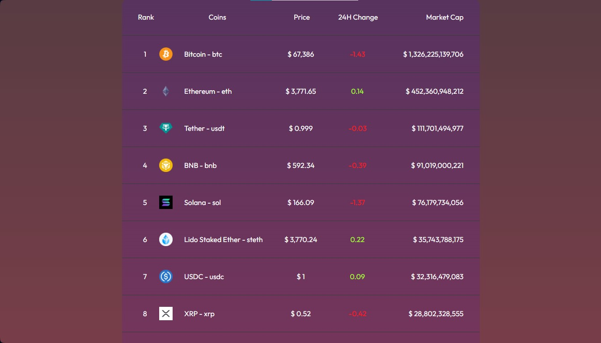
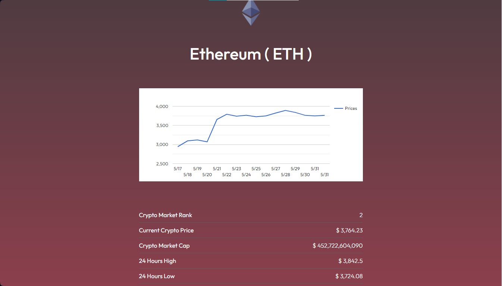
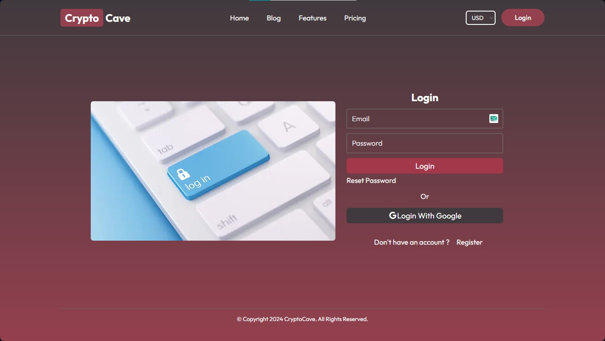

# Crypto Price App Developed with React, Redux Toolkit & Firebase

I Built a fully functional, responsive and beautiful Crypto Price using JavaScript, HTML and CSS, Git and 
Github, Firebase, Authentications, Redux / Redux Toolkit and ECMA Script on ReactJs. I fetched the Gecko API using advanced JavaScript async 
await methods and ECMA Script methods. This website is available on my Github ID. I have also hosted 
this website on Vercel at this address https://crypto-price-app-shahzaib.vercel.app to make it 
available to the public

Currently, available on:

- [https://crypto-price-app-shahzaib.vercel.app](https://crypto-price-app-shahzaib.vercel.app)

